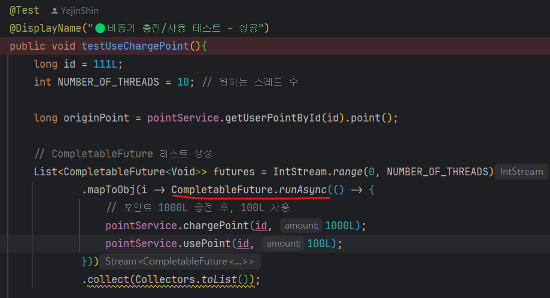
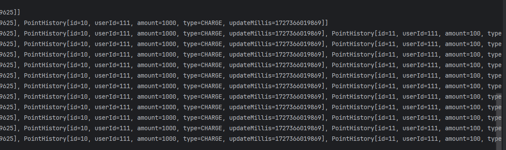

# 📝동시성 제어 방식에 대한 분석 및 보고서

## 📍프로젝트 소개
    본 프로젝트는 **포인트 충전, 조회, 사용**에 대한 API입니다. 

    ✅ 기능 & 제약조건
     ▪️ 특정 유저의 현재 포인트를 조회합니다. 
        > 값은 음수일 수 없습니다.
     ️▪️ 특정 유저의 포인트 충전/사용 이력을 조회합니다. 
     ▪ 특정 유저의 포인트를 충전합니다.
        > 충전 값은 음수일 수 없습니다. 
        > 1회 최소 충전 금액은 1000입니다. 
     ▪️ 특정 유저의 포인트를 사용합니다.
        > 사용 값은 음수일 수 없습니다.
        > 1회 최대 사용 금액은 5000입니다.
        > 가지고 있는 포인트 이상 사용할 수 없습니다.

## 📍문제 사항 분석

 * 두개 이상의 충전 또는 사용의 요청이 동시에 들어오게 되면 동일한 데이터를 수정하려고 시도할 때 데이터의 불일치가 발생합니다.
   * ex) 같은 유저의 요청이 동시에 다수로 들어왔을 때 같은 유저의 포인트 데이터를 동시에 수정하려다 보니 동시성 문제(Concurrency Issues)가 발생한다.
   * ex) 사용자 A가 1000 포인트를 가지고 있을 때 두 요청이 동시에 실행되어 500 포인트를 사용하려고 하면, 두 요청이 각각 1000 포인트로 시작한다고 가정하면 총 500 포인트가 남아야 하지만, 실제로는 동시성 문제가 발생하면 0 포인트가 남을 수 있음.

## 📍동시성 제어를 하는 방법 

*  Syncronized : 특정 메서드나 블록에 대해 동시 접근을 제한하는 가장 기본적인 방법.
* ReentrantLock: 더 복잡한 잠금 방식을 제공하며, 명시적으로 잠금을 제어할 수 있음. 특히 타임아웃과 인터럽트 기능을 제공.
* ConcurrentHashMap: 동시성 문제를 해결하기 위해 특별히 설계된 데이터 구조로, 병렬성을 지원하며 여러 스레드가 안전하게 사용할 수 있음.
* CompletableFuture : 비동기 작업을 처리하면서, 특정 시점에 모든 작업이 완료되면 결과를 병합하는 방식.

## 📍처리 과정 
* __CompletableFuture__ 사용. 
* 장점: "논블로킹(A가 B를 호출해도 제어권은 자신이 가지고 있음.)" 방식으로 동작하여 성능을 높일 수 있으므로 제어방법으로 채택하게 되었습니다.

  

  <code>CompletableFuture.allOf(futures.toArray(new CompletableFuture[0])).join();</code>
  
👉🏻CompletableFuture 작업들이 완료될 때까지 기다렸다가 한번에 실행합니디ㅏ.
  

<code>
  assertAll(
  () -> assertEquals(originPoint + (1000L - 100L) * NUMBER_OF_THREADS, result.point())
  );</code>

👉🏻 포인트 충전 및 사용의 결과를 검증 (충전한 포인트와 사용한 포인트 간의 차이 * 스레드 수)

## 📍처리 결과 

10번 실행하는 데 9.853sec이 나왔으며 순차적으로 실행하기 때문에 다수의 요청이 들어와서 
사용 포인트가 부족하더라도 데이터의 유실 없이 예외사항을 터트려 주며 정상 값을 반환해 줍니다. 

## 📍의견 
* 현재는 instance 상황에서의 동시성제어라는 한계가 있어 현재와 같은 구조로 진행하였지만 
추후 분산환경에서의 동시성 제어를 어떻게 할 것인지에 대한 고민이 필요할 것 같았습니다.

* 통합테스트와 단위테스트의 범위에 대한 고민을 많이 했으며 앞으로도 코드를 짤 때 클린아키텍처를 짜기 위한 고민을 많이 하게 될 것 같습니다.

